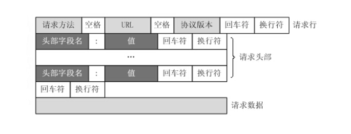

### web框架本质

```python
	我们可以这样理解：所有的Web应用本质上就是一个socket服务端，而用户的浏览器就是一个socket客户端。 这样我们就可以自己实现Web框架了。
   

纯手工框架：
    1.socket代码需要我们自己写
    2.http格式的数据自己处理(只能拿到用户输入的路由)
    
基于wsgiref模块：
    1.帮助你封装了socket代码
    2.帮你处理http格式的数据(大字典)
    
```

### HTTP协议

```python
	HTTP(Hyper Text Transfer Protocol)	超文本传输协议
    用于从WWW服务器传输超文本到本地浏览器的传输协议.HTTP是一个应用层协议,由请求和响应构成,是一个标准的个客户端和服务器模型
    
特点：
	1、支持客户端/服务器模型
    2、简单快速
    	客户向服务器请求服务时，只需传送请求方法和路径。请求方法常用的有GET、HEAD、POST。每种方法规定了客户与服务器联系的类型不同。由于HTTP协议简单，使得HTTP服务器的程序规模小，因而通信速度很快
    3、灵活
    	HTTP允许传输任意类型的数据对象
    4、无连接
    	每次连接只处理一个请求.服务器处理完客户端的请求,然后响应,并收到应答之后,就断开连接.这种方式可以节省传输时间.
    5、无状态
    	HTTP协议是无状态协议.无状态是指协议 对于事务处理没有记忆能力.这种方式的一个坏处就是,如果后续的处理需要用到之前的信息,则必须要重传,这样就导致了每次连接传输的数据量增大.好处就是,如果后续的连接不需要之前提供的信息,响应就会比较快.而为了解决HTTP的无状态特性,出现了Cookie和Session技术.

常见请求方法：
	GET：请求指定的页面信息，并返回实体主体
    POST：向指定资源提交数据进行处理，数据被包含在请求体中		
    HEAD：类似于GET请求，但是返回的响应中没有具体的内容，用于获取报头
    PUT：从客户端向服务器传送的数据取代指定文档的内容
    DELETE：请求服务器删除指定的页面
    CONNECT：HTTP/1.1协议中预留给能够将连接改为管道方式的代理服务器
    OPTIONS：允许客户端查看服务器的性能
    TRACE：回显服务器收到的请求，主要用于测试或诊断

    
HTTP工作原理
	HTTP协议定义Web客户端如何从Web服务器请求Web页面，以及服务器如何把Web页面传送给客户端。HTTP协议采用了请求/响应模型。客户端向服务器发送一个请求报文，请求报文包含请求的方法、URL、协议版本、请求头部和请求数据。服务器以一个状态行作为响应，响应的内容包括协议的版本、成功或者错误代码、服务器信息、响应头部和响应数据。
    

    
HTTP请求响应步骤：
	1、客户端连接到Web服务器
    2、发送HTTP请求
    3、服务器接受请求并返回HTTP响应
    4、释放连接TCP连接
    5、客户端浏览器解析HTML内容
    
状态码：
    200 OK  当您的操作将在响应正文中返回数据时，出现此结果。
    204 No Content 当您的操作成功，但不在响应正文中返回数据时，出现此结果。
    304 Not Modified（重定向）  当测试实体自上次检索以来是否被修改时，出现此结果。
    400 BadRequest（客户端错误） 当参数无效时，出现此结果。
    403 Forbidden   客户端错误
    401 Unauthorized 客户端错误
    404 Not Found（客户端错误） 当资源不存在时，出现此结果。
    405 Method Not Allowed（客户端错误）由于方法和资源组合不正确而出现此错误。 例如，您不能对一个实体集合使用 DELETE 或 PATCH。
    412 Precondition Failed  客户端错误
    413 Payload Too Large（客户端错误） 当请求长度过长时，出现此结果。
    501 Not Implemented（服务器错误） 当未实施某个请求的操作时，出现此结果。
    503 Service Unavailable（服务器错误） 当 Web API 服务不可用时，出现此结果。
```


### HTTP GET请求方式




### HTTP响应格式


### 自定义web框架—1

```python
    import socket

    sock = socket.socket(socket.AF_INET, socket.SOCK_STREAM)
    sock.bind(('127.0.0.1', 8000))
    sock.listen()

    while True:
        conn, addr = sock.accept()
        data = conn.recv(8096)
        # 给回复的消息加上响应状态行
        conn.send(b"HTTP/1.1 200 OK\r\n\r\n")
        conn.send(b"OK")
        conn.close()
```


### 自定义web框架—不同路径返回不同内容

```python
"""
根据URL中不同的路径返回不同的内容
"""

import socket
sk = socket.socket()
sk.bind(("127.0.0.1", 8080))  # 绑定IP和端口
sk.listen()  # 监听


while 1:
    # 等待连接
    conn, add = sk.accept()
    data = conn.recv(8096)  # 接收客户端发来的消息
    # 从data中取到路径
    data = str(data, encoding="utf8")  # 把收到的字节类型的数据转换成字符串
    # 按\r\n分割
    data1 = data.split("\r\n")[0]
    url = data1.split()[1]  # url是我们从浏览器发过来的消息中分离出的访问路径
    conn.send(b'HTTP/1.1 200 OK\r\n\r\n')  # 因为要遵循HTTP协议，所以回复的消息也要加状态行
    # 根据不同的路径返回不同内容
    if url == "/index/":
        response = b"index"
    elif url == "/home/":
        response = b"home"
    else:
        response = b"404 not found!"

    conn.send(response)
    conn.close()
```


### 自定义web框架—不同路径返回不同内容 函数版

```python
"""
根据URL中不同的路径返回不同的内容--函数版
"""

import socket
sk = socket.socket()
sk.bind(("127.0.0.1", 8080))  # 绑定IP和端口
sk.listen()  # 监听


# 将返回不同的内容部分封装成函数
def index(url):
    s = "这是{}页面！".format(url)
    return bytes(s, encoding="utf8")


def home(url):
    s = "这是{}页面！".format(url)
    return bytes(s, encoding="utf8")


while 1:
    # 等待连接
    conn, add = sk.accept()
    data = conn.recv(8096)  # 接收客户端发来的消息
    # 从data中取到路径
    data = str(data, encoding="utf8")  # 把收到的字节类型的数据转换成字符串
    # 按\r\n分割
    data1 = data.split("\r\n")[0]
    url = data1.split()[1]  # url是我们从浏览器发过来的消息中分离出的访问路径
    conn.send(b'HTTP/1.1 200 OK\r\n\r\n')  # 因为要遵循HTTP协议，所以回复的消息也要加状态行
    # 根据不同的路径返回不同内容，response是具体的响应体
    if url == "/index/":
        response = index(url)
    elif url == "/home/":
        response = home(url)
    else:
        response = b"404 not found!"

    conn.send(response)
    conn.close()
```


### 自定义web框架—不同路径返回不同内容 函数进阶版

```python
"""
根据URL中不同的路径返回不同的内容--函数进阶版
"""

import socket
sk = socket.socket()
sk.bind(("127.0.0.1", 8080))  # 绑定IP和端口
sk.listen()  # 监听


# 将返回不同的内容部分封装成函数
def index(url):
    s = "这是{}页面！".format(url)
    return bytes(s, encoding="utf8")


def home(url):
    s = "这是{}页面！".format(url)
    return bytes(s, encoding="utf8")


# 定义一个url和实际要执行的函数的对应关系
list1 = [
    ("/index/", index),
    ("/home/", home),
]

while 1:
    # 等待连接
    conn, add = sk.accept()
    data = conn.recv(8096)  # 接收客户端发来的消息
    # 从data中取到路径
    data = str(data, encoding="utf8")  # 把收到的字节类型的数据转换成字符串
    # 按\r\n分割
    data1 = data.split("\r\n")[0]
    url = data1.split()[1]  # url是我们从浏览器发过来的消息中分离出的访问路径
    conn.send(b'HTTP/1.1 200 OK\r\n\r\n')  # 因为要遵循HTTP协议，所以回复的消息也要加状态行
    # 根据不同的路径返回不同内容
    func = None  # 定义一个保存将要执行的函数名的变量
    for i in list1:
        if i[0] == url:
            func = i[1]
            break
    if func:
        response = func(url)
    else:
        response = b"404 not found!"

    # 返回具体的响应消息
    conn.send(response)
    conn.close()
```


### 自定义web框架—返回网页

```python
"""
根据URL中不同的路径返回不同的内容--函数进阶版
返回独立的HTML页面
"""

import socket
sk = socket.socket()
sk.bind(("127.0.0.1", 8080))  # 绑定IP和端口
sk.listen()  # 监听


# 将返回不同的内容部分封装成函数
def index(url):
    # 读取index.html页面的内容
    with open("index.html", "r", encoding="utf8") as f:
        s = f.read()
    # 返回字节数据
    return bytes(s, encoding="utf8")


def home(url):
    with open("home.html", "r", encoding="utf8") as f:
        s = f.read()
    return bytes(s, encoding="utf8")


# 定义一个url和实际要执行的函数的对应关系
list1 = [
    ("/index/", index),
    ("/home/", home),
]

while 1:
    # 等待连接
    conn, add = sk.accept()
    data = conn.recv(8096)  # 接收客户端发来的消息
    # 从data中取到路径
    data = str(data, encoding="utf8")  # 把收到的字节类型的数据转换成字符串
    # 按\r\n分割
    data1 = data.split("\r\n")[0]
    url = data1.split()[1]  # url是我们从浏览器发过来的消息中分离出的访问路径
    conn.send(b'HTTP/1.1 200 OK\r\n\r\n')  # 因为要遵循HTTP协议，所以回复的消息也要加状态行
    # 根据不同的路径返回不同内容
    func = None  # 定义一个保存将要执行的函数名的变量
    for i in list1:
        if i[0] == url:
            func = i[1]
            break
    if func:
        response = func(url)
    else:
        response = b"404 not found!"

    # 返回具体的响应消息
    conn.send(response)
    conn.close()
```


### 自定义web框架—动态网页

```python
"""
根据URL中不同的路径返回不同的内容--函数进阶版
返回HTML页面
让网页动态起来
"""

import socket
import time

sk = socket.socket()
sk.bind(("127.0.0.1", 8080))  # 绑定IP和端口
sk.listen()  # 监听


# 将返回不同的内容部分封装成函数
def index(url):
    with open("index.html", "r", encoding="utf8") as f:
        s = f.read()
        now = str(time.time())
        s = s.replace("@@oo@@", now)  # 在网页中定义好特殊符号，用动态的数据去替换提前定义好的特殊符号
    return bytes(s, encoding="utf8")


def home(url):
    with open("home.html", "r", encoding="utf8") as f:
        s = f.read()
    return bytes(s, encoding="utf8")


# 定义一个url和实际要执行的函数的对应关系
list1 = [
    ("/index/", index),
    ("/home/", home),
]

while 1:
    # 等待连接
    conn, add = sk.accept()
    data = conn.recv(8096)  # 接收客户端发来的消息
    # 从data中取到路径
    data = str(data, encoding="utf8")  # 把收到的字节类型的数据转换成字符串
    # 按\r\n分割
    data1 = data.split("\r\n")[0]
    url = data1.split()[1]  # url是我们从浏览器发过来的消息中分离出的访问路径
    conn.send(b'HTTP/1.1 200 OK\r\n\r\n')  # 因为要遵循HTTP协议，所以回复的消息也要加状态行
    # 根据不同的路径返回不同内容
    func = None  # 定义一个保存将要执行的函数名的变量
    for i in list1:
        if i[0] == url:
            func = i[1]
            break
    if func:
        response = func(url)
    else:
        response = b"404 not found!"

    # 返回具体的响应消息
    conn.send(response)
    conn.close()
```


WSGI模块定义server

```python
对于真实开发中的python web程序来说，一般会分为两部分：服务器程序和应用程序。

服务器程序负责对socket服务器进行封装，并在请求到来时，对请求的各种数据进行整理。

应用程序则负责具体的逻辑处理。为了方便应用程序的开发，就出现了众多的Web框架，例如：Django、Flask、web.py 等。不同的框架有不同的开发方式，但是无论如何，开发出的应用程序都要和服务器程序配合，才能为用户提供服务。

这样，服务器程序就需要为不同的框架提供不同的支持。这样混乱的局面无论对于服务器还是框架，都是不好的。对服务器来说，需要支持各种不同框架，对框架来说，只有支持它的服务器才能被开发出的应用使用。

这时候，标准化就变得尤为重要。我们可以设立一个标准，只要服务器程序支持这个标准，框架也支持这个标准，那么他们就可以配合使用。一旦标准确定，双方各自实现。这样，服务器可以支持更多支持标准的框架，框架也可以使用更多支持标准的服务器。

WSGI（Web Server Gateway Interface）就是一种规范，它定义了使用Python编写的web应用程序与web服务器程序之间的接口格式，实现web应用程序与web服务器程序间的解耦。

常用的WSGI服务器有uwsgi、Gunicorn。而Python标准库提供的独立WSGI服务器叫wsgiref，Django开发环境用的就是这个模块来做服务器。

```

代码

```python
"""
根据URL中不同的路径返回不同的内容--函数进阶版
返回HTML页面
让网页动态起来
wsgiref模块版
"""

import time
from wsgiref.simple_server import make_server


# 将返回不同的内容部分封装成函数
def index(url):
    with open("index.html", "r", encoding="utf8") as f:
        s = f.read()
        now = str(time.time())
        s = s.replace("@@oo@@", now)
    return bytes(s, encoding="utf8")


def home(url):
    with open("home.html", "r", encoding="utf8") as f:
        s = f.read()
    return bytes(s, encoding="utf8")


# 定义一个url和实际要执行的函数的对应关系
list1 = [
    ("/index/", index),
    ("/home/", home),
]


def run_server(environ, start_response):
    start_response('200 OK', [('Content-Type', 'text/html;charset=utf8'), ])  # 设置HTTP响应的状态码和头信息
    url = environ['PATH_INFO']  # 取到用户输入的url
    func = None
    for i in list1:
        if i[0] == url:
            func = i[1]
            break
    if func:
        response = func(url)
    else:
        response = b"404 not found!"
    return [response, ]


if __name__ == '__main__':
    httpd = make_server('127.0.0.1', 8090, run_server)
    print("我在8090等你哦...")
    httpd.serve_forever()
```


