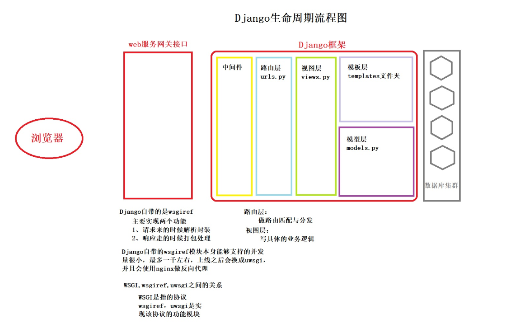

### django生命周期流程图



```PYTHON
# 每个人都要会画 这个图是你们后期复习django最好的一个梳理方式


# 扩展知识点
	"""
	缓存数据库
		提前已经将你想要的数据准备好了 你来直接拿就可以
		提高效率和响应时间
		
	当你在修改你的数据的时候 你会发现数据并不是立刻修改完成的
	而是需要经过一段时间才会修改
		博客园
	
	了解即可
	"""

    """
浏览器
	发送请求(HTTP协议)

web服务网关接口
	1.请求来的时候解析封装
		响应走的时候打包处理

	2.django默认的wsgiref模块不能承受高并发 最大只有1000左右
		上线之后会替换成uwsgi来增加并发量
	
	3.WSGI跟wsgiref和uwsgi是什么关系
		WSGI是协议
		wsgiref和uwsgi是实现该协议的功能模块

django后端
	1.django中间件(暂时不考虑 后面讲)
		类似于django的保安 门户
		
	2.urls.py  路由层
		识别路由匹配对应的视图函数
	
	3.views.py	视图层
		网站整体的业务逻辑
		
	4.templates文件夹		模版层
		网站所有的html文件
	
	5.models.py				模型层
		ORM
额外扩展:缓存数据库的作用
"""
```


### CBV如何添加装饰器

```python
from django.views import View
from django.utils.decorators import method_decorator
"""
CBV中django不建议你直接给类的方法加装饰器
无论该装饰器能都正常给你 都不建议直接加
"""

# @method_decorator(login_auth,name='get')  # 方式2(可以添加多个针对不同的方法加不同的装饰器)
# @method_decorator(login_auth,name='post')
class MyLogin(View):
    @method_decorator(login_auth)  # 方式3:它会直接作用于当前类里面的所有的方法
    def dispatch(self, request, *args, **kwargs):
        return super().dispatch(request,*args,**kwargs)
    # @method_decorator(login_auth)  # 方式1:指名道姓
    def get(self,request):
        return HttpResponse("get请求")

    def post(self,request):
        return HttpResponse('post请求')
```


### django外部脚本调用django环境

```python
import os
os.environ.setdefault("DJANGO_SETTINGS_MODULE", "django_cookie.settings")
import django
django.setup()

from app01 import  models
models.Book.objects.create(
    title='xxx',
    price=200,
)
```


### django版本区别

```python
"""
1.django1.X路由层使用的是url方法
	而在django2.Xhe3.X版本中路由层使用的是path方法
	url()第一个参数支持正则
	path()第一个参数是不支持正则的 写什么就匹配什么
	
	
	如果你习惯使用path那么也给你提供了另外一个方法
		from django.urls import path, re_path
		from django.conf.urls import url
		
		re_path(r'^index/',index),
    url(r'^login/',login)
  2.X和3.X里面的re_path就等价于1.X里面的url
 
 
2.虽然path不支持正则 但是它的内部支持五种转换器
	path('index/<int:id>/',index)
	# 将第二个路由里面的内容先转成整型然后以关键字的形式传递给后面的视图函数

	def index(request,id):
    print(id,type(id))
    return HttpResponse('index')
    
  
  
  str,匹配除了路径分隔符（/）之外的非空字符串，这是默认的形式
	int,匹配正整数，包含0。
	slug,匹配字母、数字以及横杠、下划线组成的字符串。
	uuid,匹配格式化的uuid，如 075194d3-6885-417e-a8a8-6c931e272f00。
	path,匹配任何非空字符串，包含了路径分隔符（/）（不能用？）
	
3.除了有默认的五个转换器之外 还支持自定义转换器(了解)
	class MonthConverter:
    regex='\d{2}' # 属性名必须为regex

    def to_python(self, value):
        return int(value)

    def to_url(self, value):
        return value # 匹配的regex是两个数字，返回的结果也必须是两个数字
	
	
	from django.urls import path,register_converter
	from app01.path_converts import MonthConverter

	# 先注册转换器
	register_converter(MonthConverter,'mon')

	from app01 import views


	urlpatterns = [
    path('articles/<int:year>/<mon:month>/<slug:other>/', 	views.article_detail, name='aaa'),

]


4.模型层里面1.X外键默认都是级联更新删除的
但是到了2.X和3.X中需要你自己手动配置参数
	models.ForeignKey(to='Publish')
	
	models.ForeignKey(to='Publish',on_delete=models.CASCADE...)
"""
```


### 视图层补充

```python
"""
HttpResponse
	返回字符串类型
render
	返回html页面 并且在返回给浏览器之前还可以给html文件传值
redirect
	重定向
"""
# 视图函数必须要返回一个HttpResponse对象  正确   研究三者的源码即可得处结论
The view app01.views.index didn't return an HttpResponse object. It returned None instead.

# render简单内部原理
		from django.template import Template,Context
        res = Template('<h1>{{ user }}</h1>')
        con = Context({'user':{'username':'jason','password':123}})
        ret = res.render(con)
        print(ret)
        return HttpResponse(ret)
```


### JsonResponse对象

```python
"""
json格式的数据有什么用？
	前后端数据交互需要使用到json作为过渡 实现跨语言传输数据

前端序列化
	JSON.stringify()					json.dumps()
	JSON.parse()							json.loads()
"""
import json
from django.http import JsonResponse
def ab_json(request):
    user_dict = {'username':'jason好帅哦,我好喜欢!','password':'123','hobby':'girl'}

    l = [111,222,333,444,555]
    # 先转成json格式字符串
    # json_str = json.dumps(user_dict,ensure_ascii=False)
    # 将该字符串返回
    # return HttpResponse(json_str)
    # 读源码掌握用法
    # return JsonResponse(user_dict,json_dumps_params={'ensure_ascii':False})
    # In order to allow non-dict objects to be serialized set the safe parameter to False.
    # return JsonResponse(l,safe=False)  
    # 默认只能序列化字典 序列化其他需要加safe参数	
    作为一个开发人员，必须要学会看源码， 通过源码或者报错信息快速定义异常所在位置
```

### 

### form表单上传文件及后端如何操作

```python
"""
form表单上传文件类型的数据
	1.method必须指定成post
	2.enctype必须换成formdata

"""
def ab_file(request):
    if request.method == 'POST':
        # print(request.POST)  # 只能获取普通的简直对数据 文件不行
        print(request.FILES)  # 获取文件数据
        # <MultiValueDict: {'file': [<InMemoryUploadedFile: u=1288812541,1979816195&fm=26&gp=0.jpg (image/jpeg)>]}>
        file_obj = request.FILES.get('file')  # 文件对象
        print(file_obj.name)
        with open(file_obj.name,'wb') as f:
            for line in file_obj.chunks():  # 推荐加上chunks方法 其实跟不加是一样的都是一行行的读取
                f.write(line)

    return render(request,'form.html')
```

### request对象方法

```python
"""
request.method
request.POST
request.GET
request.FILES
request.body  # 原生的浏览器发过来的二进制数据  后面详细的讲
request.path 
request.path_info
request.get_full_path()  能过获取完整的url及问号后面的参数 
"""
    print(request.path)  # /app01/ab_file/
    print(request.path_info)  # /app01/ab_file/
    print(request.get_full_path())  # /app01/ab_file/?username=jason
```

### FBV与CBV