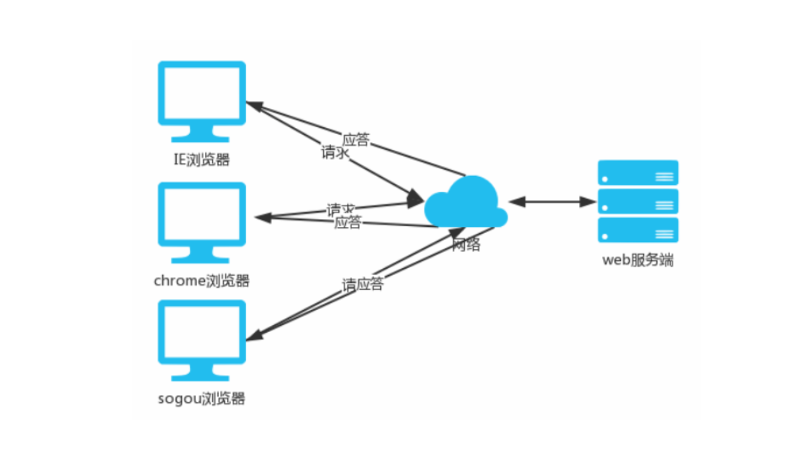
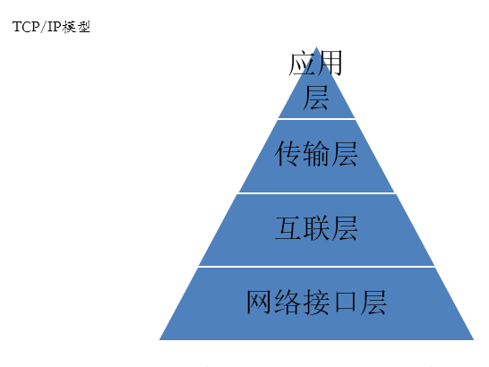
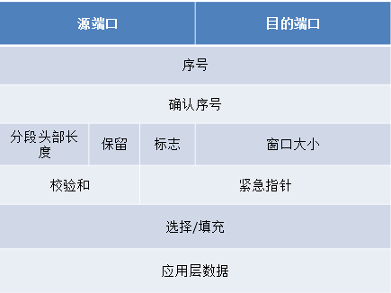
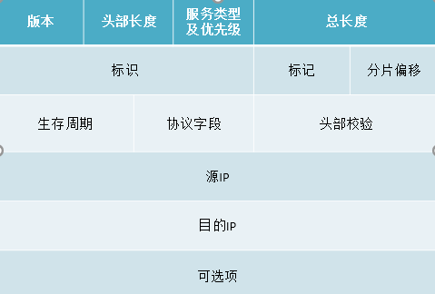
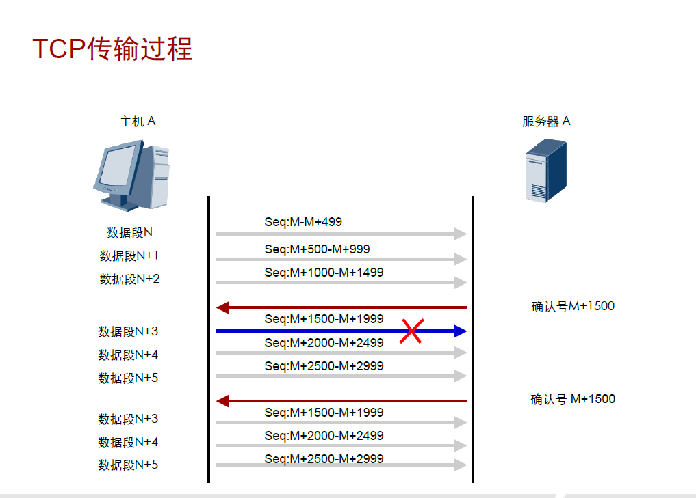
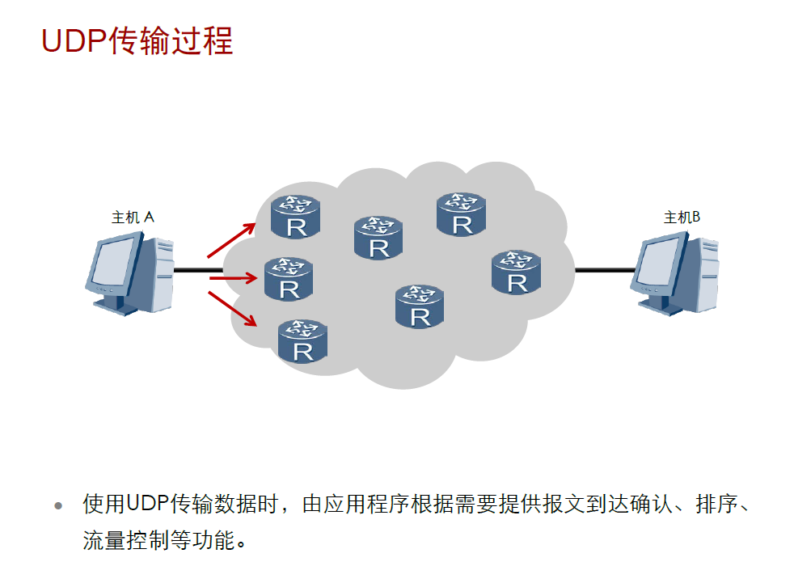

### 网络基础

常见的两种架构模式

**B/S架构:**

​	 即浏览器，服务器架构   Brower  server


**C/S架构：**

​		客户端，服务器架构     client  server



### OSI七层模型：

|        层级         |                             作用                             |              | 单位 |
| :-----------------: | :----------------------------------------------------------: | :----------: | :--: |
|       应用层        |                        用户或程序接口                        | Telnet，FTP  |      |
|       表示层        |                数据的表现形式、特定功能的实现                | 如加密，图片 |      |
|       会话层        |                    对应用会话的管理、同步                    |              |      |
|  传输层（segment）  | 可靠与不可靠的传输、传输前的错误检测、流控，定义端到端的数据传递方式 |   TCP,UDP    |  段  |
|  网络层（packet）   |    提供逻辑（IP）地址、选路。定义端到端数据传递的路径信息    |  IP,ARP,IPX  |  包  |
| 数据链路层（frame） |           成帧、用MAC地址访问媒介、错误检测与修正            |              |  帧  |
|    物理层（bit）    |         设备之间的比特流的传输、物理接口、电气特性等         |              | 比特 |

```python
	OSI：Open System Internetwork 开放式系统互联
    	注：下层为上层提供服务，同层次之间使用相同的协议
		面向应用的上层：
			应用层，表示层，会话层
		面向端到端的数据流层：
			传输层，网络层，数据链路层，物理层
            
	层间通信：
		计算机内的通信:
			为紧邻的上下层之间的通信.数据在不同的层内称呼也有特别的定义(PDU,协议数据单元):
				传输层:段(segment)
				网络层: 包(packet)
				数据链路层: 帧(frame)
				物理层: 位(bit)
			发送数据时,数据流向是从上至下传输,也称为数据的封装
			接入数据时,数据流向是从下至上传输,也称为数据的解封装
			注：数据的封装过程中会添加每一层的头部信息，便于接收方接收处理
		计算机间的通信:
			为计算机间对等层之间的通信.
					FCS帧校验合（序列）
	
	 OSI 参考模型(IOS 制订)分层化的优点:
		把网络任务分层，并定义标准的层间接口，可使各个独立的协议或者层更简洁
		便于学习和讨论协议规范的很多细节
		层间的标准接口便于工程模块化，使每种产品可以只完成某几层的功能
		创建了一个更好的互操作环境
		降低了复杂性，提高程序修改和产品开发的效率
		便于定位和排除故障
		每层利用紧邻的下层服务，并向紧邻的上层提供服务
        
	OSI 层间通讯
		封装：把每一层的数据放置在包头和包尾之间，然后发送给下一层。
		解封装：是封装的反向过程，把去掉本层头部和尾部的数据发往其上一层
		协议数据单元(PDU):数据包括封装进去的信息在 OSI 参考模型每层的叫法:
			Transport layer:segment 段
			Network layer:packet 包
			Data Link layer:frame 帧
			Physical layer:bits 位
```

### TCP/IP：

```python
 MAC地址：
    	48个二进制位标识设备，以16进制表示分为6段，每段8位，通常以冒号隔开， 有OUI（组织厂商标识，通俗说是厂商代码）和序列号（设备）两部分组成  ，OUI由IEEE为每一个厂商固定分配，前24bit由IEEE统一管理，分配给生产厂家后24bit由厂家根据产品来唯一指定

 IP地址：
		32个二进制 由网络部分（位）和主机部分（位）组成，使用子网掩码进行区分，通常以十进制表示 用点号隔开 分为4段 每段8位
    
子网掩码：
		32个二进制 通常以十进制表示 用点号隔开 分为4段 每段8位 必须由连续的1和连续的0组成   子网掩码中1的个数越多，0的个数就越少，主机位数就越少，主机数量就越少
    
IP地址分类：
        A：1.0.0.0~126.255.255.255
        B：128.0.0.0~191.255.255.255
        C：192.0.0.0~223.255.255.255
        D：224.0.0.0~239.255.255.255
        E：240.0.0.0~255.255.255.254
        
特殊地址：
        0.0.0.0代表任意地址
        127.0.0.0~127.255.255.255代表本地回环地址（用于测试TCP/IP协议栈自身）
        169.254.0.0~169.254.255.255 DHCP保留
        255.255.255.255 广播地址，代表本地所有主机

 ARP：
        ARP报文不能穿越路由器，不能被转发到其他路由器
        IP地址分为网络部分和主机部分 
        网络地址的主机位全为0，广播地址的主机位全为1
        区分网络位和主机位方法：子网掩码中1对应IP地址中的网络部分，0对应IP地址中的主机部分
        

```

### TCP/IP报文格式

```python
TCP封装信息：
		源端口（source port）   
    	目标端口（destination port）  
        序列号（排序） 
        确认号（确认）   
        syn同步   
        fin接受    
        Windows窗口大小（流控） 
        checksun 首部校验
        
IP报文头部：
        Version;版本
        Header  Length:头部长度
        DS Field；服务类型及优先级
        Total Length：总长度，最大65535bit
        Identification：标识
         Flags ：标记
        Fragment Offset：分片偏移
        Time to Live：生存周期
        Protocol ：协议字段（
        Header Checksum:头部校验
        Source IP Address：源IP
        Destination IP Address：目的IP
        IP Options：可选项
```




***TCP报文***




***IP报文***




### TCP协议建立连接的过程





```python
常用TCP端口号：
		23（telnet） 22（ssh） 20+21（ftp） 
    	80（http） 25 （SMTP） 110（pop3）443（https） 53（dns）

三次握手：
    	第一次握手：建立连接时，客户端发送syn包（syn=j）到服务器，并进入SYN_SENT状态，等待服务器确认；SYN：同步序列编号（Synchronize Sequence Numbers）。
    	第二次握手：服务器收到syn包，必须确认客户的SYN（ack=j+1），同时自己也发送一个SYN包（syn=k），即SYN+ACK包，此时服务器进入SYN_RECV状态；
		第三次握手：客户端收到服务器的SYN+ACK包，向服务器发送确认包ACK(ack=k+1），此包发送完毕，客户端和服务器进入ESTABLISHED（TCP连接成功）状态，完成三次握手。
                                   
四次挥手：
    	第一步，当主机A的应用程序通知TCP数据已经发送完毕时，TCP向主机B发送一个带有FIN附加标记的报文段（FIN表示英文finish）。
    	第二步，主机B收到这个FIN报文段之后，并不立即用FIN报文段回复主机A，而是先向主机A发送一个确认序号ACK，同时通知自己相应的应用程序：对方要求关闭连接（先发送ACK的目的是为了防止在这段时间内，对方重传FIN报文段）。
    	第三步，主机B的应用程序告诉TCP：我要彻底的关闭连接，TCP向主机A送一个FIN报文段。
    	第四步，主机A收到这个FIN报文段后，向主机B发送一个ACK表示连接彻底释放。

```

### 网络设备：

```python
交换机的工作原理（收到数据如何处理）：
		当交换机收到数据帧后，首先地址学习，然后取出目的 MAC 地址，查看是不是自己的，如果是就留下处理，如果不是就查看 CAM 表， CAM表中有对应 MAC 地址的条目，就按照条目指定的端口转发出去，如果没有对应的条目，就泛洪（将数据从所有连了线的接口转发出去）
    
交换机收到一个数据帧时，有三种可能的转发方式
    直通转发——交换机收到一个帧，只要检查到目的的 MAC 地址就转发
    存储转发——交换机先把这个帧存储起来，做冗余校验，没有损坏才转发出去
    无碎片转发——只检查帧的前 64 字节，就将数据帧转发出去。
    注：当交换机收到一个数据帧，如果查看 CAM 表后，发现这个数据帧的出口就是进口的时候，直接丢弃
    
什么是路由？ 
    路由是将数据包从源发送到目的地的一个过程，路由器可以分割网络
路由器的工作原理（路由器收到数据如何处理）
	当路由器收到数据包后，查看是不是自己的，是就留下，不是，就查看路由表，路由表中有对应条目，就按照条目指定的接口转发出去。如果没有对应条目，直接丢弃。
    

```

### UDP的传输过程





